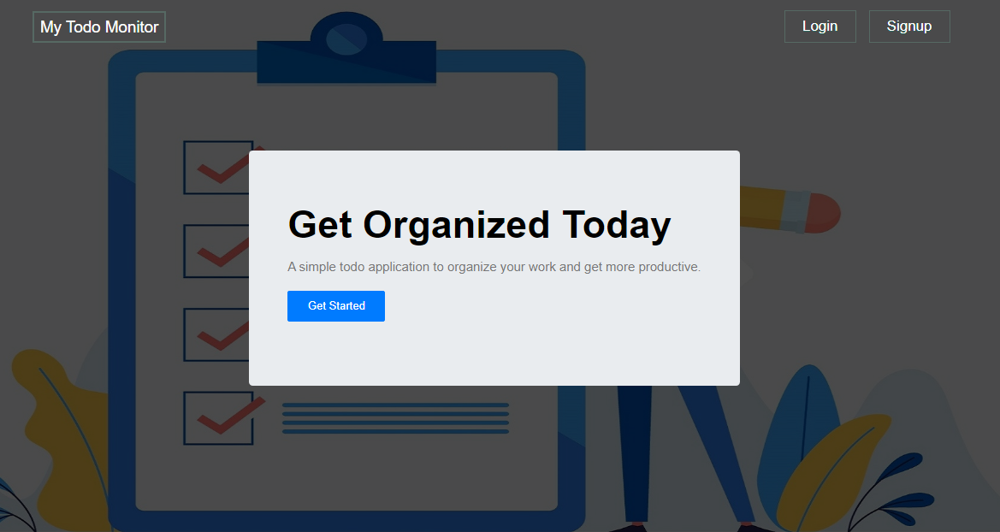
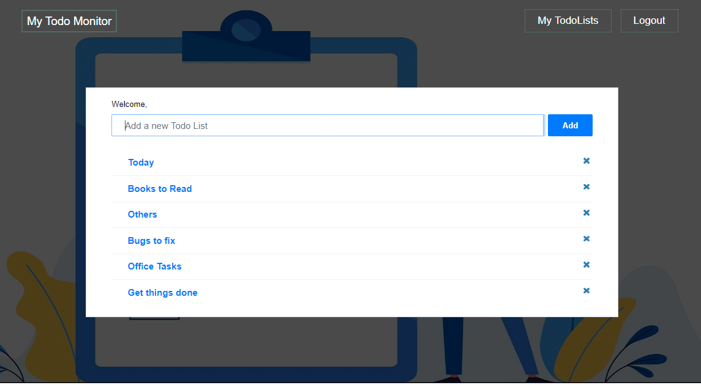

# simple-todo-app

### A simple todo application to organize your work and get more productive.

### [Live demo](https://mytodomonitor.herokuapp.com/)

## Screenshots





## Stacks

- Node js
- Express js
- MongoDB
- ReactJs

## Installation

```
git clone https://github.com/Ethical-Ralph/simple-todo-app.git
cd simple-todo-app

cd client
npm install or yarn install

cd server
cp .env.example .env
then add mongodb url and JWT secret in the .env file
npm install or yarn install

```

### Client

```
npm start
```

## Server

```
npm run watch:dev
```
